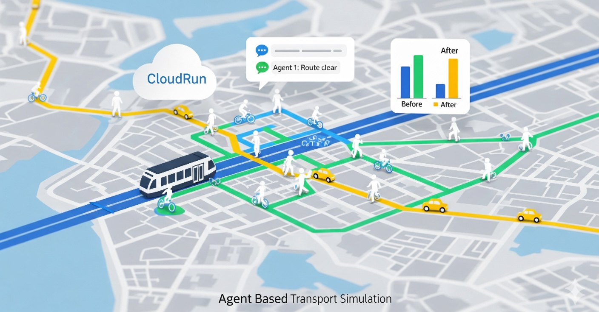

# CityFlow

Lightweight Agent Based Transport Simulation + AI insights. One container. One deploy.

- Backend: **FastAPI + Uvicorn**
- Frontend: **Multi-page site** in `web/` served by FastAPI
- Simulation: `transport_sim/`
- Ready for **Google Cloud Run** with scale to zero
- Optional OpenAI-powered insights (`OPENAI_API_KEY`)



## Features

- Single FastAPI service serves **API** and **static pages**
- Multi-page frontend (MPA), no SPA router needed
- Agent-based simulation stub with configurable inputs
- Simple **/files** static mount for downloadable outputs
- **/v1/** API namespace to keep routes clean
- Cloud Run friendly: scale to zero, cold start tolerant

## Stack

- Python 3.11
- FastAPI, Uvicorn
- Starlette StaticFiles
- (Optional) OpenAI for insights/chat

## Project Layout

```
cityflow/
├─ api/
│  ├─ main.py                 # FastAPI app entry. Serves API + web/
│  ├─ globals.py              # ROOT_DIR, DATA_ROOT, WEB_DIR, middleware, warmups
│  └─ routes/
│     ├─ health.py            # /v1/health
│     ├─ cities.py            # /v1/cities
│     ├─ submit.py            # /v1/submit   (start a sim)
│     ├─ status.py            # /v1/status   (check sim status)
│     ├─ insights.py          # /v1/insights (analytics / summaries)
│     └─ chat.py              # /v1/chat     (LLM assistant, optional)
├─ transport_sim/             # Simulation engine and helpers
├─ web/                       # Multi-page frontend (index.html, map.html, etc.)
│  ├─ index.html
│  ├─ map.html
│  ├─ results.html
│  └─ assets/...
├─ data/                      # Input/outputs, optional in-repo samples
├─ requirements.txt
├─ Dockerfile                 # Minimal. Uvicorn entrypoint.
└─ README.md
```

> If your pages use pretty URLs (for example `/map` instead of `/map.html`), `api/main.py` includes a tiny handler or link directly with `.html` in anchors.

## Quickstart

### 1) Local run (no Docker)

```bash
python -m venv .venv
source .venv/bin/activate        # Windows: .venv\Scripts\activate
pip install -r requirements.txt

# Optional if you use OpenAI features
export OPENAI_API_KEY="sk-...your key..."

uvicorn api.main:app --host 0.0.0.0 --port 8080 --reload
```

Now open:
- Site: http://localhost:8080/
- Health: http://localhost:8080/v1/health

### 2) Local run with Docker

```bash
docker build -t cityflow .
docker run -p 8080:8080 \
  -e OPENAI_API_KEY="sk-...optional..." \
  cityflow
```

## Configuration

### Environment variables

| Name               | Required | Default | Description |
|--------------------|----------|---------|-------------|
| `OPENAI_API_KEY`   | No       | empty   | Enables LLM features in `/v1/insights` and `/v1/chat`. |
| `PORT`             | No       | `8080`  | Set by Cloud Run. For local Docker you can leave default. |
| `CITYFLOW_DATA_DIR`| No       | `data/` | If set in `globals.py`, overrides the default `DATA_ROOT`. |

### Static mounts

- `/` serves the multi-page site from `web/`
- `/files` serves downloadable artifacts from `data/` (or `CITYFLOW_DATA_DIR`)

## API Reference

Base URL: `/v1`

| Method | Path                 | Purpose                              |
|--------|----------------------|--------------------------------------|
| GET    | `/v1/health`         | Liveness and version info            |
| GET    | `/v1/cities`         | List of supported demo cities        |
| POST   | `/v1/submit`         | Start a simulation job               |
| GET    | `/v1/status/{job_id}`| Poll simulation status and outputs   |
| POST   | `/v1/insights`       | Compute insights for a scenario      |
| POST   | `/v1/chat`           | LLM chat for analysis and guidance   |

> Exact request and response shapes are simple JSON. Check each route file in `api/routes/` for schemas. Typical simulation runs complete within 3 minutes. Set Cloud Run timeout to at least 240 seconds.

## Deployment on Google Cloud Run

### Option A: Console (continuous deploy from GitHub)

1. Cloud Run → Create service → **Continuously deploy from a repository**
2. Connect GitHub, pick your repo and branch
3. Build method: **Dockerfile**
4. Service settings:
   - Region: `europe-west2` (London) or your preference
   - CPU 1, Memory 1 GiB
   - Timeout 300 s
   - Concurrency 1 or 2
   - Min instances 0
   - Ingress: all
   - Authentication: allow unauthenticated (for public demo)
5. Variables & Secrets → add `OPENAI_API_KEY` or use Secret Manager (recommended)
6. Deploy. Map a custom domain when ready.

### Option B: gcloud CLI

```bash
gcloud builds submit --tag europe-west2-docker.pkg.dev/PROJECT_ID/cityflow/cityflow:latest

gcloud run deploy cityflow \
  --image europe-west2-docker.pkg.dev/PROJECT_ID/cityflow/cityflow:latest \
  --region europe-west2 \
  --platform managed \
  --allow-unauthenticated \
  --port 8080 \
  --cpu 1 --memory 1Gi \
  --timeout 300 \
  --concurrency 1 \
  --min-instances 0
```

#### Secret Manager (best practice)

```bash
echo -n "sk-..." | gcloud secrets create openai-api-key --data-file=-

gcloud secrets add-iam-policy-binding openai-api-key \
  --member="serviceAccount:PROJECT_NUMBER-compute@developer.gserviceaccount.com" \
  --role="roles/secretmanager.secretAccessor"

gcloud run services update cityflow \
  --region europe-west2 \
  --set-secrets OPENAI_API_KEY=openai-api-key:latest
```

### Custom domain

- Cloud Run → Custom domains → Map domain
- Add the suggested DNS records in Route53
- Let Google manage the certificate

## Dockerfile

This repo includes a minimal Dockerfile that works on Cloud Run:

```dockerfile
FROM python:3.11-slim
ENV PIP_NO_CACHE_DIR=1 PYTHONDONTWRITEBYTECODE=1 PYTHONUNBUFFERED=1
WORKDIR /app

COPY requirements_prod.txt .
RUN pip install -r requirements_prod.txt

COPY . .
ENV PORT=8080
CMD ["uvicorn", "api.main:app", "--host", "0.0.0.0", "--port", "8080"]
```

`.dockerignore` recommended:

```
__pycache__/
*.pyc
*.pyo
*.pytest_cache/
.venv/
venv/
.git/
node_modules/
dist/
build/
```

## Development tips

- Register API routers before mounting the static site. Keep the static mount last so it does not shadow `/v1/*`.
- For multi-page sites, link to `.html` files directly (for example `/map.html`), or add a small “pretty URLs” handler if you want `/map`.
- During local dev, use `--reload` with Uvicorn and a `.env` file for convenience. Do not commit the `.env`.

## Troubleshooting

- **404 on API routes**  
  Check mount order. API routers must be included before `app.mount("/", StaticFiles(...))`.
- **Only one server allowed**  
  Do not run `http.server` alongside Uvicorn. Cloud Run exposes a single port. FastAPI serves both pages and API.
- **Cold starts**  
  Expect 2 to 6 seconds for a ~200 MB image. Keep min instances at 0 for lowest cost.
- **Large outputs**  
  Write artifacts to `data/` and link them under `/files/...`.

## License

MIT — see `LICENSE`.

## Contact
-------

- Maintainer: Obaid Malik
- Website: https://obaidmalik.co.uk
- LinkedIn: https://linkedin.com/in/malikobaid1
- Contact: malikobaid@gmail.com
- Issues: please use GitHub Issues for bugs and feature requests
